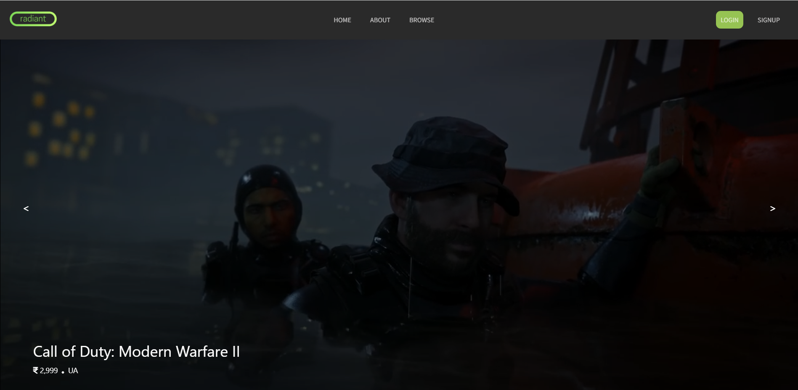
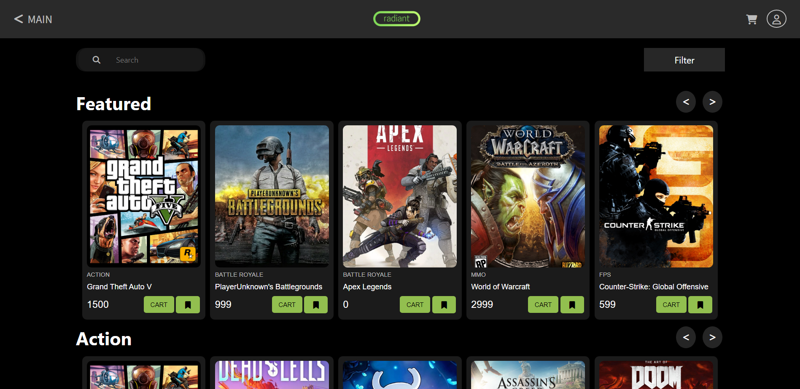
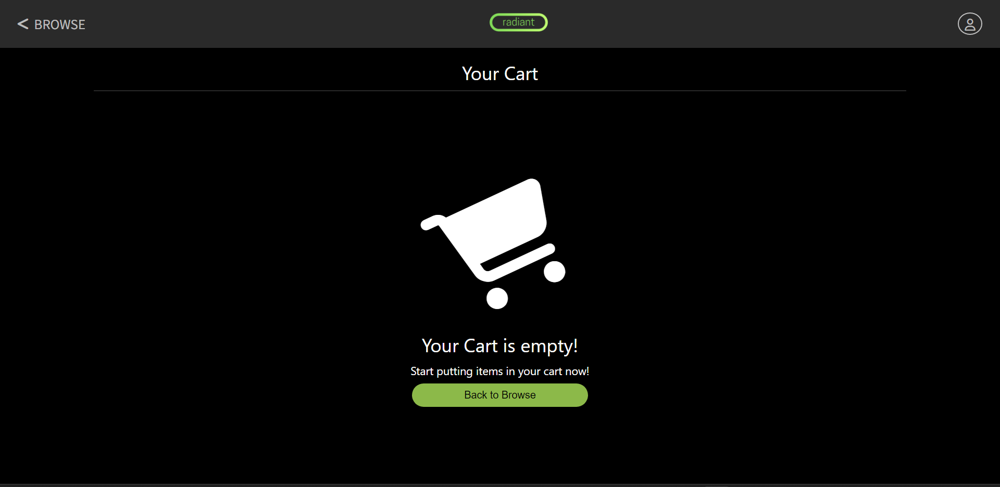
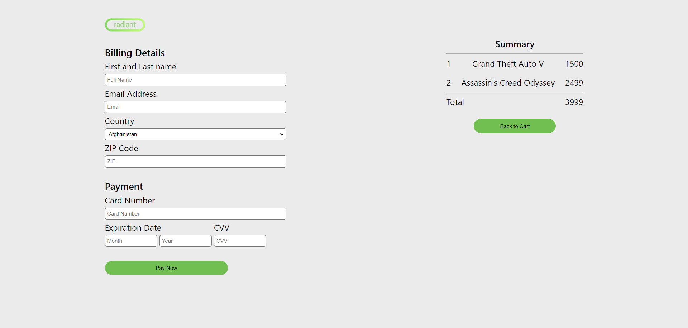
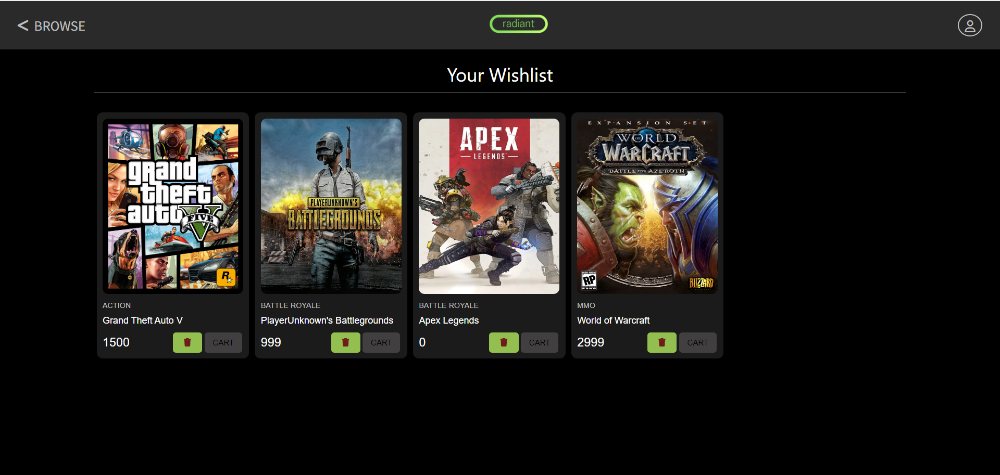
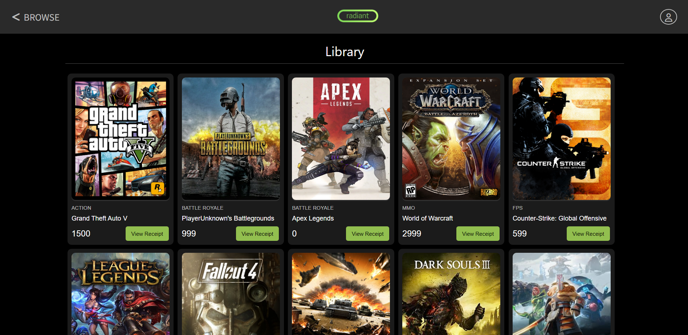

# 🎮 Radiant Games – Online Games Store

## 📌 About
Radiant Games is a **web-based platform** for browsing, buying, and learning more about popular, new, and fun video games — all under one roof.  

- Quickly **search** for games across multiple genres.  
- **Read details** about each game before making a choice.  
- **Purchase games** with a smooth checkout process.  
- Maintain a **wishlist** and manage your **library** easily.  

---

## 🛠️ Tech Stack
- **Frontend:** HTML, CSS, JavaScript  
- **Backend:** PHP, XAMPP (MySQL for database)  
- **Data:** Games data stored in `.xlsx` and `.csv` files  
- **Additional Assets:** Images, screenshots, and videos for UI/UX support  

---

## 📂 Project Structure
# 🎮 Radiant Games – Online Games Store

## 📌 About
Radiant Games is a **web-based platform** for browsing, buying, and learning more about popular, new, and fun video games — all under one roof.  

- Quickly **search** for games across multiple genres.  
- **Read details** about each game before making a choice.  
- **Purchase games** with a smooth checkout process.  
- Maintain a **wishlist** and manage your **library** easily.  

---

## 🛠️ Tech Stack
- **Frontend:** HTML, CSS, JavaScript  
- **Backend:** PHP, XAMPP (MySQL for database)  
- **Data:** Games data stored in `.xlsx` and `.csv` files  
- **Additional Assets:** Images, screenshots, and videos for UI/UX support  

---

## 📂 Project Structure
```text
├── gamesRadiant.xlsx          # Dataset (Excel)
├── gamesRadiantcsv.csv        # Dataset (CSV)
│
├── about/                     # About page
│   ├── about.html
│   ├── logo.png
│   ├── css/
│   │   └── about.css
│   └── images/
│       └── bg.png
│
├── main/                      # Main application
│   ├── main.html
│   ├── connect.php
│   ├── css/
│   │   └── main.css
│   ├── js/                    # JS scripts
│   ├── images/                # Game assets
│   ├── videos/                # Demo videos
│   └── sample/                # Sample files
│
├── Images_screenshots/        # Project screenshots & diagrams
└── Presentations/             # Presentations & charts
```

## 🚀 Features
- 🔎 **Browse Games** by categories (Action, Adventure, Sports, etc.)  
- 📝 **Signup/Login** system with validation  
- 🛒 **Shopping Cart & Checkout** flow  
- 💳 **Payment & Receipt** generation  
- 📚 **Personal Library & Wishlist** management  
- 📊 **Database integration** with game details  

---

## 📸 Screenshots
Here are some previews of the project:

  
  
  
  
  
  

## 📦 Installation & Setup
1. Clone this repository:
   ```bash
   git clone https://github.com/aaryanchothani/Radiant-Games-Online-Games-Store
2. Move the project into your XAMPP htdocs folder.

3. Start Apache and MySQL in XAMPP.

4. Import the game dataset (gamesRadiant.xlsx or gamesRadiantcsv.csv) into MySQL.

5. Open http://localhost/main/main.html in your browser.
